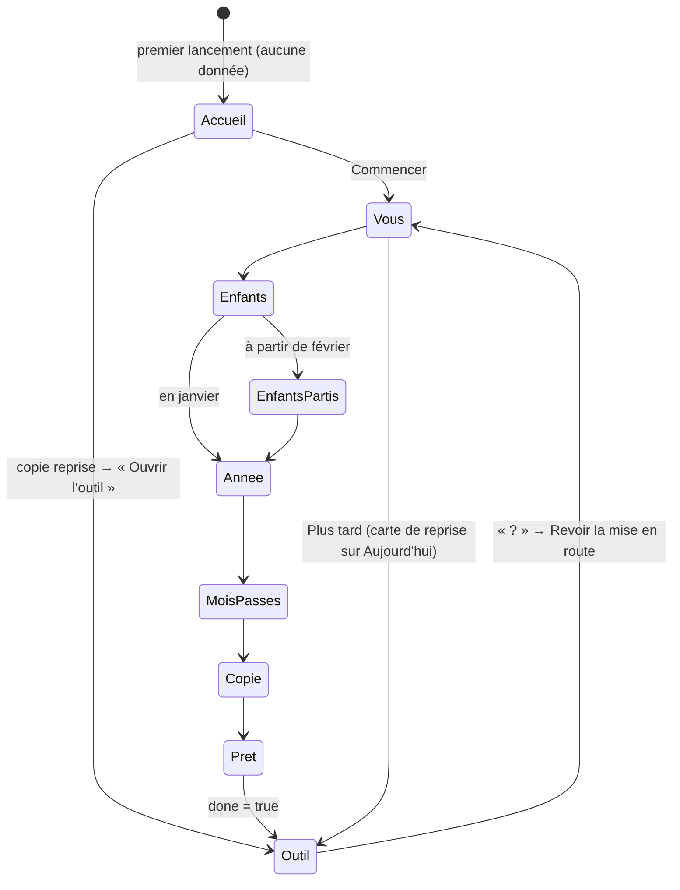
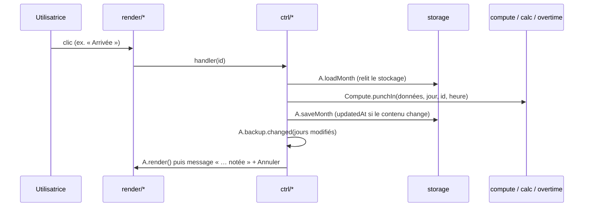

# Architecture des écrans (lot 12)

```mermaid
flowchart TD
  CFG["config.js<br/>SMIC, coefficient, 4 enfants, seuil 10 h"]
  UTIL["lib/utils.js<br/>dates, fériés, HH:MM, montants"]
  CALC["lib/calc.js<br/>abattement, simultanéité"]
  OT["lib/overtime.js<br/>heures sup. + explications"]
  STO["lib/storage/*<br/>mois v3, profil v2, réglages d'année,<br/>années déclarées, fusion, état de copie"]
  AUTO["lib/autosave.js · lib/image.js<br/>dossier de copie (ordinateur), photo compressée"]
  CMP["lib/compute/*<br/>enfants, récap, relevé, pré-remplissage,<br/>calendrier, pointeuse, mise en route,<br/>vérification du mois, rappels de copie"]
  DEV["storage/device.js · storage/fiches.js<br/>état de l'appareil, photos (IndexedDB)"]
  RND["lib/render/*<br/>DOM seulement (R.h, jamais innerHTML de données)"]
  CTX["ctrl/ctx.js · shell.js<br/>état, lecture/écriture, Annuler ;<br/>A.go, A.render, bulles d'aide"]
  BK["ctrl/backup + backup-send + backup-folder + backup-import<br/>copie de secours, rappels"]
  PH["ctrl/photos.js<br/>photos de la fiche (cache, prendre, supprimer)"]
  PR["ctrl/print.js<br/>#print-doc"]
  SCR["ctrl/day · review · month-calendar · month<br/>today · profile + profile-edit · year"]
  ONB["ctrl/onboarding-kids · onboarding-steps · onboarding<br/>mise en route guidée"]
  APP["app.js<br/>onglets, aide, mise en route ou onglet de départ, service worker"]

  CFG --> UTIL --> CALC --> OT --> STO --> AUTO --> CMP --> DEV --> RND --> CTX
  CTX --> BK --> PH --> PR --> SCR --> ONB --> APP
```

Pas de modules ES : l'ordre des `<script>` dans `index.html` fait office de système de modules. Chaque couche ne dépend que des couches au-dessus d'elle ; seules `render/` et `ctrl/` touchent le DOM, et seul `ctrl/` lit ou écrit le stockage à la demande d'un geste.

## Plein écran : mise en route et vérification du mois

`A.render` (`ctrl/shell.js`) dessine la mise en route si `A.state.onboarding`, sinon l'onglet courant (et la vérification du mois si `A.state.review`) ; dans les deux cas `body.is-focus` masque les onglets.

## Cycle d'un geste

