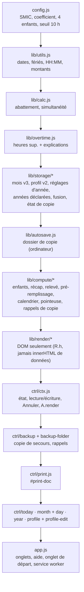
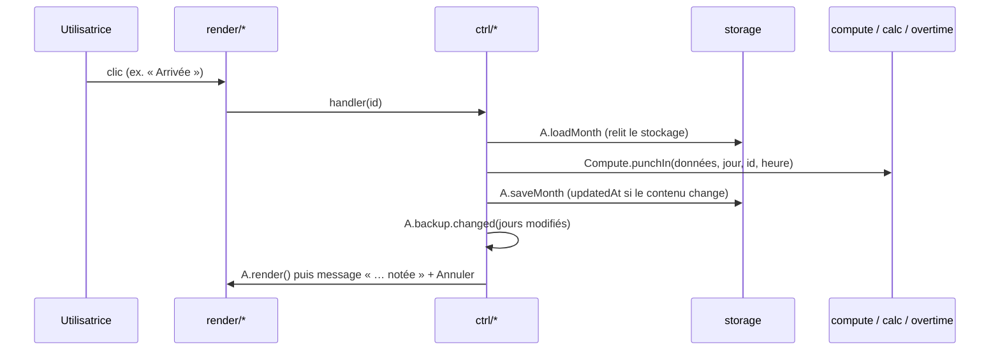

# Architecture des écrans (lot 12)

Pas de modules ES : l'ordre des `<script>` dans `index.html` fait office de système de modules. Chaque couche ne dépend que des couches au-dessus d'elle ; seules `render/` et `ctrl/` touchent le DOM, et seul `ctrl/` lit ou écrit le stockage à la demande d'un geste.

## Cycle d'un geste

