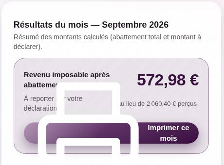
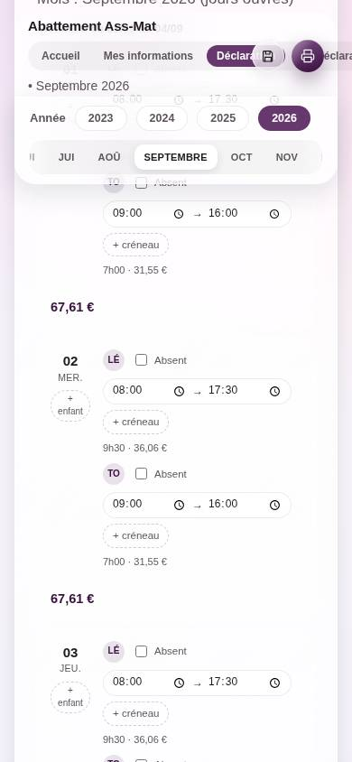

# Revue complète de l'outil — 29 septembre 2026

Revue demandée sur quatre axes : **justesse** du calcul, **saisie au fil de l'année**, **RGPD**, **simplicité pour une assistante maternelle peu à l'aise avec l'informatique**, plus une notation de l'interface (design, éco-conception, facilité d'usage) et des textes. La proposition pour les **heures supplémentaires** est dans un document séparé : [`spec-heures-supplementaires.md`](spec-heures-supplementaires.md).

Méthode : lecture de tout le code (`app/`, `index.html`, `sw.js`, tests, docs), suite `node --test` (48/48 verts), puis l'appli pilotée dans Chromium (ordinateur 1280 px et iPhone 390 px) : profil, pré-remplissage, saisie, fiche de paie, Ma déclaration, impression, menu Données, fiche « Points d'attention ». Les bugs ci-dessous sont **reproduits**, pas supposés.

> **Suivi (29/09/2026, même jour)** : C1 (case 1AJ annuelle), C2 (dossier complet), C3 (montants), C4 (1AJ ou 1BJ ; la case d'abattement 1GA/1HA reste à confirmer), les défauts visuels du §5 ⑤ + JUIN/JUIL., et l'erreur de la fiche IRF sont **corrigés** sur la branche. Le reste du plan d'action (§10, P1/P2) est repris dans le lot 12 de la feuille de route.

---

## 1. En bref

Le socle est **sain et bien pensé** : moteur de calcul pur et testé, données 100 % locales, sauvegarde automatique avec fusion entre appareils, documents imprimés sobres et crédibles. Mais **trois défauts touchent le chiffre final ou le document remis**, et l'interface demande encore trop d'efforts à une personne non technicienne.

**À corriger avant la prochaine déclaration (printemps 2027) :**

1. 🔴 Le montant de la **case 1AJ peut être surévalué** : le plancher à 0 € est appliqué mois par mois au lieu d'une seule fois sur l'année.
2. 🔴 **« Imprimer le dossier complet » n'imprime que le récapitulatif** : les relevés mensuels sont effacés au moment où l'impression démarre.
3. 🟠 **Un montant tapé avec une virgule peut être multiplié par 100** (1234,56 → 123 456 €) quand le navigateur n'est pas réglé en français.
4. 🟠 **Défauts visibles à l'écran** : icône d'imprimante géante sur les deux boutons principaux, écran « Ma déclaration » sans mise en forme, iPhone qui déborde.

### Notes

| Critère | Note | En une phrase |
|---|---|---|
| Justesse du calcul | **6/10** | Règle jour/enfant juste et testée, mais le total annuel peut être faux (→ 9/10 une fois le point 1 corrigé) |
| Saisie au fil de l'année | **7/10** | Semaines types, recopie, sauvegarde auto : très bon socle ; manque « jour non travaillé » et « annuler » |
| RGPD / vie privée | **8/10** | Exemplaire sur le fond (rien ne sort de l'appareil) ; adresse partagée et aucune suppression possible |
| Simplicité d'usage | **5/10** | Trop de notions, deux onglets presque homonymes, textes petits, jargon |
| Interface (design visuel) | **5,5/10** | Esthétique soignée et cohérente, mais bugs visibles et mobile cassé |
| Éco-conception | **7,5/10** | ≈ 87 Ko, zéro tiers, hors-ligne ; effets de verre coûteux |
| Textes & explications | **5/10** | Ton bienveillant, mais jargon, une erreur de fond, du vocabulaire de développeur |
| Accessibilité | **4,5/10** | 2 tailles de police sur 3 à 13,5 px ou moins (jusqu'à 8,5 px), mois ambigus, fenêtres système |
| Code & maintenabilité | **6,5/10** | Architecture claire, calcul testé ; `app.js` de 1 386 lignes, conventions du projet pas tenues partout |
| **Global** | **6/10** | Une très bonne base qu'il faut fiabiliser puis simplifier, avant d'y ajouter des fonctions |

---

## 2. Justesse du calcul

### Ce qui est juste ✅

- Règle **par jour et par enfant**, ≥ 8 h → 3 × SMIC, < 8 h → prorata `forfait × heures ÷ 8`, créneaux additionnés **avant** d'appliquer le seuil de 8 h : conforme.
- **SMIC au 1er janvier de l'année des revenus** (11,27 / 11,65 / 11,88 / 12,02) : conforme aux guides publiés (35,64 €/jour pour les revenus 2025).
- Absences, créneaux invalides (sortie avant entrée, horaire incomplet) signalés et **exclus** du calcul, jamais comptés en silence.
- Jours fériés calculés (Pâques par Meeus/Butcher), dates en heure locale (pas de décalage d'un jour lié au fuseau).
- Une seule source de calcul (`state.data` → `calc.js`), migration v1 → v2, normalisation à l'import : solide.

### 🔴 C1 — Case 1AJ surévaluée par le plancher mensuel

`compute/year-recap.js` calcule pour **chaque mois** `imposable = max(0, perçu − abattement)` puis **additionne** ces montants pour obtenir la case 1AJ. Or le calcul fiscal est **annuel** : total perçu de l'année − abattement de l'année, et c'est **ce résultat** qui ne peut pas être négatif. Quand un mois a plus d'abattement que de revenus, l'excédent est perdu au lieu de compenser les autres mois.

| | Perçu | Abattement | Outil (mois planchers) | Correct (annuel) |
|---|---|---|---|---|
| Janvier | 1 000 € | 1 500 € | 0 € | |
| Février | 2 000 € | 500 € | 1 500 € | |
| **Année** | 3 000 € | 2 000 € | **1 500 €** | **1 000 €** |

Ce n'est pas un cas d'école : c'est exactement ce qui arrive (a) avec un **versement décalé** (paie de janvier versée en février, cas documenté de certains CCAS), (b) avec **3 enfants à temps plein** et un salaire mensualisé : les mois de 22-23 jours ouvrés, l'abattement peut dépasser la paie. Testé sur les vrais modules : janvier sans paie + février avec deux paies → l'outil affiche **2 036,40 €** en case 1AJ au lieu de **0 €**.

**Correction** (≈ 1 h, test compris) : `totals.imposable = max(0, round2(totals.percu − totals.abatt))`. Garder le plancher mensuel pour l'affichage d'un mois si on veut, mais le nommer « part de ce mois », jamais « à déclarer ».

### 🔴 C2 — Le dossier complet n'imprime que le récapitulatif

`printFullDossier()` assemble récap + relevés dans `#print-doc`, puis appelle `window.print()`. Chrome déclenche alors l'évènement `beforeprint`, écouté par `buildPrintDoc()`, qui **reconstruit `#print-doc` avec le seul récap annuel** (on est sur « Ma déclaration »). Mesuré dans Chromium : **1 feuille au lieu de 4** pour 3 mois renseignés. Ce cas échappe à une vérification du DOM faite avant l'appel à l'impression.

**Correction** (≈ 30 min) : un indicateur « dossier en cours » posé par `printFullDossier()` et levé sur `afterprint`, que `buildPrintDoc()` respecte.

### 🟠 C3 — Montants : la virgule dépend de la langue du navigateur

Les champs « net imposable » et « IRF » sont des `<input type="number">`. Mesuré dans Chromium : navigateur en français → `1234,56` est bien lu ; **navigateur en anglais → `123456`**, enregistré sans aucun message. Un PC acheté avec Windows en anglais, un Chrome réglé en anglais ou certains navigateurs mobiles suffisent.

**Correction** : `type="text" inputmode="decimal"`, lecture de la virgule et du point (le champ SMIC le fait déjà), et **réaffichage du montant compris** (« 1 234,56 € ») pour que l'erreur se voie.

### 🟠 C4 — Case 1AJ… ou 1BJ

L'encart dit toujours « case 1AJ ». Si l'assistante maternelle est **déclarant 2** de son foyer, c'est **1BJ**. Plusieurs guides indiquent aussi que la déclaration en ligne demande désormais le **montant de l'abattement dans une case dédiée (1GA / 1HA)** en plus du revenu net en 1AJ/1BJ. L'outil calcule déjà ce montant : il suffit de l'afficher à côté. **À confirmer sur la page d'aide d'impots.gouv avant la campagne 2027** (la procédure en ligne change d'une année à l'autre).

### 🟠 C5 — SMIC manuel : stocké par mois, effacé en douce

- Le SMIC de référence est **annuel**, mais la saisie manuelle (`smicOverride`) est enregistrée **par mois** : on peut avoir deux SMIC différents la même année.
- `getSmicInfo()` (app.js) **efface** l'override dès que le barème contient l'année, et sauvegarde, alors que c'est une fonction de lecture. Le récap annuel, lui, garde l'override des mois jamais rouverts. **Même mois, deux résultats** selon l'écran (le test `year-recap.test.js` fige d'ailleurs un override à 10 € sur 2026 alors que le barème dit 12,02 €).
- Correction : un override **par année** (une clé), une règle unique « le barème gagne toujours s'il existe », appliquée dans `compute/`, pas dans un getter d'affichage.

### 🟠 C6 — Versements décalés : une convention à écrire noir sur blanc

La fiche « Points d'attention » dit que les **IRF** se rattachent au mois de versement. C'est vrai aussi du **net imposable** (revenus encaissés). La convention implicite de l'outil devient : *chaque mois = horaires réels du mois + fiche de paie versée ce mois-là*. Elle est défendable, mais elle doit être **écrite dans l'écran de saisie**, et deux cas limites sont à **valider avec le centre des impôts (SIP)** : la première année (des jours sans paie) et la dernière (une paie sans jours). Avec un décalage, le « revenu imposable du mois » n'a d'ailleurs aucun sens : raison de plus pour n'afficher comme « à déclarer » que le total annuel (cf. C1).

### Points mineurs

- **« Jours de garde »** n'a pas le même sens partout : relevé mensuel = jours avec au moins un enfant (22), récap annuel = journées-enfant (21 + 22 = 43). Un contrôleur le verra ; dire « journées-enfant » dans le récap.
- Deux créneaux d'un même enfant qui **se chevauchent** (8h-12h + 11h-13h) sont additionnés (6 h au lieu de 5 h) sans alerte.
- Le dernier mois non déclaré d'une année ne prévient de rien : un bandeau « 2 mois sans fiche de paie » dans Ma déclaration éviterait une case 1AJ incomplète.

---

## 3. Saisie au fil de l'année

**Très bon socle** : semaine type par enfant et pré-remplissage d'un mois en un clic (fériés exclus), « recopier la semaine précédente », plusieurs créneaux par jour, absences avec motif, sauvegarde automatique dans OneDrive avec fusion mois par mois entre PC et iPhone, import qui **fusionne** au lieu d'écraser. C'est exactement ce qu'il faut pour une saisie « au fil de l'eau ».

Ce qui manque ou gêne à l'usage :

1. **Pas de « je n'ai pas travaillé ce jour / cette semaine »**. Après un pré-remplissage, une semaine de congés de l'assistante maternelle = 10 cases « Absent » ou 20 horaires à effacer. Il faut une action de jour (« Jour non travaillé ») et de semaine (« Semaine de congés »), et un « Vider le mois ».
2. **Pas d'annulation** après un pré-remplissage, une recopie ou un import (le « toast Annuler » du lot 5 est toujours différé). Pour une personne qui a peur de « tout casser », c'est un vrai frein.
3. **La fiche de paie est tout en bas**, après ~22 cartes de jours. C'est pourtant la seule autre action du mois (2 champs). La remonter en haut de la colonne résultat.
4. **Les onglets de mois n'indiquent aucun état** (complet / fiche de paie manquante / vide) : pour savoir où on en est, il faut aller dans « Ma déclaration ».
5. **« Recopier la semaine précédente »** ne marche pas pour la première semaine du mois (la semaine précédente est dans l'autre mois).
6. **Les enfants sont désignés par leurs initiales** (« LÉ », « TO », ou « E1 » sans profil) : on ne lit le prénom qu'au survol de la souris.
7. **« ✓ Enregistré » est caché** dans le menu Données (il faut l'ouvrir pour le voir), alors que le lot 3 voulait justement le rendre visible pour rassurer.
8. **Le bandeau « Vos données ne sont pas sur cet appareil »** s'affiche à une utilisatrice qui découvre l'outil (inquiétant : « quelles données ? »), et disparaît définitivement dès la première visite de Déclaration, parce que consulter un mois vide enregistre un mois vierge (`loadAndRenderMonth` → `saveNow`).
9. **Conflit entre appareils** : arbitré par une fenêtre système `confirm()` où « OK » = version du fichier et « Annuler » = version de l'appareil. Incompréhensible pour une non-technicienne, et on perd toutes les modifications d'un côté pour ce mois.
10. Semaine type : un seul créneau par jour, pas de semaines alternées (A/B). À ajouter seulement si le besoin existe.

---

## 4. RGPD et confidentialité

Données concernées : nom, employeur, n° d'agrément, **prénoms et horaires d'enfants mineurs** (qui révèlent les rythmes des familles), revenus.

**Ce qui est exemplaire** ✅ : aucun serveur, aucune mesure d'audience, aucun cookie, aucun CDN ni police Google, aucun appel réseau dans le code ; liens externes en `noopener noreferrer` ; la sauvegarde reste entre ses mains ; données minimisées (prénom seulement). Le rejet du CMS/base de données (lot 6) était la bonne décision.

À améliorer :

1. **Adresse partagée (le point le plus sérieux)** : l'outil est servi depuis `aurelienbby.github.io`. Le stockage du navigateur (localStorage, IndexedDB) est **commun à toutes les pages publiées sous ce compte GitHub Pages**. Toute autre page publiée un jour sous ce compte pourrait lire les données de l'outil. → Servir l'outil sur **un sous-domaine dédié** (le « plan B » déjà documenté), qui isole complètement son stockage.
2. **Aucune suppression possible** : ni « supprimer une année », ni « tout effacer » ; un enfant « désactivé » garde son prénom pour toujours. → Ajouter « Supprimer l'année… » et « Tout effacer de cet appareil », et suggérer de supprimer les années dont le délai de contrôle est passé (en règle générale trois ans après l'année de déclaration — à confirmer).
3. **Rendre la promesse vérifiable** : une politique de sécurité (`Content-Security-Policy` avec `connect-src 'none'`) interdit techniquement tout envoi réseau. Il faut pour cela sortir le petit script en ligne d'`index.html` et les `style="…"` injectés par le JS.
4. **Un encart « Vos données »** (3 lignes, dans Mes informations) : ce qui est stocké, où (ce navigateur + le dossier OneDrive choisi), comment tout effacer, et que l'hébergeur (GitHub) voit l'adresse IP à l'ouverture. Rappeler que le fichier de sauvegarde contient les prénoms des enfants : ne pas l'envoyer par e-mail.
5. Le fichier OneDrive est en clair : acceptable (compte personnel, choix de l'utilisatrice). Un chiffrement par mot de passe est possible sans dépendance, mais un mot de passe oublié = données perdues : **je ne le recommande pas par défaut** pour ce public.

---

## 5. Revue design (retour de designer d'interface)

### Ce qui fonctionne

- Identité visuelle **cohérente** (tokens, teinte Prune, composants réutilisables), cartes de jours aérées, héros du résultat lisible.
- L'**onboarding en 3 étapes** raconte bien le parcours (informations → mois → année).
- Les **documents imprimés** sont très réussis : sobres, hiérarchisés, crédibles devant un contrôleur. C'est le meilleur livrable de l'outil.

### Ce qui bloque

**① Architecture : 4 onglets, dont deux presque homonymes.** « Déclaration » (où l'on saisit ses heures, on ne déclare rien) et « Ma déclaration » (le bilan de l'année) se confondent. Accueil est une page qu'on ne visite plus après la première fois. Proposition :

| Aujourd'hui | Proposé |
|---|---|
| Accueil | *(affiché au premier lancement seulement, puis accessible via « Aide »)* |
| Mes informations | **Mon profil** |
| Déclaration | **Mes mois** |
| Ma déclaration | **Mon année** (ou « Pour mes impôts ») |

**② Hiérarchie de la page du mois.** Le premier écran est occupé par « Paramètres de calcul » (information de référence, aucune action) ; la fiche de paie est tout en bas. Proposition d'ordre : barre des mois avec état → fiche de paie (2 champs) + résultat → jours du mois. Les règles se replient en une ligne : « ℹ︎ En 2026 : 36,06 € par enfant pour une journée de 8 h ou plus ».

**③ Barre des mois.** Juin et juillet s'affichent tous les deux **« JUI »** (visible ci-dessus). Écrire « JUIN » / « JUIL. », et ajouter une pastille d'état par mois (✓ complet, ● à compléter).

**④ Carte d'un jour.** Par enfant : initiales, case « Absent », deux champs horaires, « + créneau », puis « 9h30 · 36,06 € » en 11 px gris. C'est dense et petit. Proposition : `[Léa] [08:00 → 17:30]  9 h 30` en 16 px, total du jour à droite ; « Absent » et « 2ᵉ horaire » dans un petit menu « … » par enfant.

**⑤ Bugs visuels (à corriger en premier, ≈ 1 h au total).**

- L'**icône d'imprimante** des boutons « Imprimer ce mois » et « Imprimer le dossier complet » s'affiche en taille géante et recouvre le résultat : aucune règle ne dimensionne `.btn svg`.

  

- **« Ma déclaration » n'est plus mise en forme** : les styles des lignes de détail (`.summary-row`) sont limités à `#month-results` et la classe `.card` n'a aucun style. Depuis que le récap a quitté la colonne du mois (lot 10), les libellés, aides et montants se collent (« TOTAL IRFSomme de toutes les…210,00 € ») et la carte se rétrécit.

  

- **iPhone** : la page déborde en largeur (430 px pour un écran de 390), les boutons Données/Imprimer recouvrent l'onglet « Déclaration », l'onglet « Ma déclaration » est coupé, et le bandeau collant occupe un quart de la hauteur pendant la saisie.

  

**⑥ Typographie.** Base à 17 px, mais **66 % des tailles déclarées à l'écran font 13,5 px ou moins** (8,5 px pour « Férié », 10 px pour « + enfant » et les initiales, 11 px pour les heures et montants de chaque enfant). Pour ce public : 16 px minimum pour le contenu, 14 px pour les aides, rien sous 13 px.

**⑦ Verre (« liquid glass »).** Joli, mais le flou réduit le contraste du texte posé dessus et coûte cher en calcul graphique (cf. §6). Le garder pour la barre du haut ; cartes et tableau sur fond opaque ; respecter `prefers-reduced-transparency`.

**⑧ Mobile.** Remplacer les onglets du haut par une **barre d'onglets en bas** (3 icônes + libellés, le standard des applications iPhone), et ne garder collé en haut que le mois en cours.

**⑨ Dialogues.** Remplacer les `confirm()` / `alert()` système par des fenêtres de l'appli aux boutons explicites : « Garder la version de l'ordinateur (mardi 14 h 02) » / « Garder la version du téléphone (mardi 18 h 40) ».

**⑩ Retours visuels.** Coche « Enregistré » visible en permanence près du titre ; après un pré-remplissage : « 22 jours remplis. Corrigez les jours différents. [Annuler] » ; icône « Données » avec un **libellé** (« Sauvegarde »), pas seulement une disquette.

**⑪ Accueil.** Le raccourci « Commencer la saisie » est **désactivé** tant que le profil est vide, alors que la saisie fonctionne sans profil : ne jamais bloquer. Le bouton « Voir les points d'attention » apparaît deux fois sur le même écran.

---

## 6. Éco-conception

| Mesure (page du mois) | Valeur |
|---|---|
| Poids transféré | **≈ 87 Ko** compressé (302 Ko brut) |
| Requêtes | 48 (tous fichiers locaux) |
| Tiers (CDN, polices, mesure d'audience) | **0** |
| Premier affichage (local) | 240 ms |
| Éléments de page | ≈ 730 |

C'est **excellent** : une page web moyenne pèse plus de 2 Mo. Pas de framework, pas de police téléchargée, pas d'image lourde, hors-ligne complet, impression à la demande.

Pistes :

1. **Effets de verre** : `backdrop-filter: blur(24-30px) saturate()` sur la barre collante et les cartes, plus un fond en `background-attachment: fixed` = recalcul graphique à chaque défilement. Coûteux sur un vieux PC ou sur batterie, et contraire aux recommandations du RGESN (référentiel d'écoconception). Réduire le flou, fonds opaques pour les cartes.
2. **Service worker « réseau d'abord »** : à chaque ouverture en ligne, 48 requêtes de revalidation. Une stratégie « cache d'abord + mise à jour en arrière-plan », avec un numéro de version, ferait zéro requête utile la plupart du temps, et garderait des mises à jour rapides.
3. **Impression** : le dossier complet fait de 13 à 25 pages A4 par an selon le nombre d'enfants. Proposer d'abord « Enregistrer en PDF », n'imprimer sur papier que le récapitulatif ; le relevé mensuel pourrait tenir sur une page (une ligne par jour plutôt qu'une ligne par enfant).
4. Le dossier `handoff_liquid_glass/` est publié sur GitHub Pages sans être utilisé (négligeable, mais inutile en ligne).

---

## 7. Textes et explications

**Principes pour ce public** : phrases courtes ; les **mots de sa fiche de paie** ; pas de symboles (≥, ÷) ni de formules ; un exemple chiffré vaut mieux qu'une règle ; jamais de vocabulaire de développeur (« piliers », « destinations », « JSON », « fusionner », « import »).

**Une erreur de fond à corriger** dans la fiche « Points d'attention » : la carte « IRF hors calcul de l'abattement » dit que les IRF « servent uniquement au rapprochement avec la fiche de paie ». **C'est faux** : les IRF s'ajoutent au net imposable **avant** de retirer l'abattement ; elles ne changent simplement pas le montant de l'abattement. Même fiche : le titre « Uniquement les heures réellement travaillées » contredit son texte (ce sont les heures de **présence des enfants**, pas les heures de travail).

**L'explication qui manque le plus** : *pourquoi* l'abattement existe, dit simplement. Proposition : « Garder un enfant vous coûte (repas, jeux, chauffage, usure…). Pour en tenir compte, une partie de ce que vous gagnez n'est pas imposée : c'est l'abattement. Il dépend du nombre de jours et d'heures où chaque enfant était chez vous. » Et, juste à côté des champs, **où trouver les montants sur la fiche de paie du CCAS** (idéalement une fiche annotée).

### Avant → après

| Aujourd'hui | Proposition |
|---|---|
| Déclaration / Ma déclaration | Mes mois / Mon année |
| Paramètres de calcul — déclaration avec abattement | Comment c'est calculé en 2026 *(replié)* |
| Forfait (par enfant, garde ≥ 8h) : 36,06 € | Journée de 8 h ou plus : 36,06 € par enfant |
| Forfait (par enfant, garde < 8h) : (forfait ÷ 8) × heures de présence | Moins de 8 h : environ 4,51 € par heure de présence |
| Revenu net imposable : Montant "net imposable" du mois. | Net imposable — ligne « Net imposable » de la fiche de paie (ce n'est pas la somme virée) |
| Indemnités représentatives de frais (IRF) : Si vous n'en avez pas, laissez 0. | Indemnités d'entretien et de repas — sur la fiche de paie. Pas d'indemnités ? Laissez vide. |
| Revenu imposable après abattement — À reporter sur votre déclaration. *(résultat du mois)* | Ce mois-ci compte pour 572,98 € dans votre revenu. Rien à déclarer maintenant : le total vous attend dans « Mon année ». |
| Case 1AJ … reportez X dans la case « Traitements et salaires » (1AJ) | … case 1AJ (ou 1BJ si vous êtes le « déclarant 2 » du foyer) |
| Vos données ne sont pas sur cet appareil. Si vous avez une sauvegarde (fichier abattement-assmat-….json)… | Première visite ? Commencez par « Mon profil ». Vous avez déjà utilisé l'outil ailleurs ? [Récupérer ma sauvegarde] |
| Le tutoriel et les règles ne se répètent plus à chaque mois — ils vivent ici, une seule fois. | *(à supprimer : parle de l'historique de l'outil, pas de son usage)* |
| Trois destinations, dans l'ordre | Comment ça marche, en 3 étapes |
| L'abattement vous est-il favorable cette année ? / Option gagnante | Avec l'abattement, vous déclarez 820 € au lieu de 1 850 €. C'est le plus avantageux pour vous. |
| Comparaison indicative — la structure des indemnités en CCAS est à vérifier sur les bulletins. | *(à supprimer ou reformuler : « Vérifiez que vos indemnités ne sont pas déjà comprises dans le net imposable. »)* |
| TOTAL REVENUS NET IMPOSABLES / TOTAL IRF | Salaires (net imposable) / Indemnités |
| J<8h: 22 • J≥8h: 17 | 17 journées complètes, 22 journées courtes |
| Statut : Incomplet | Fiche de paie manquante / Horaires manquants |
| Sauvegarder l'année / Charger les données | Enregistrer une copie de l'année / Récupérer une sauvegarde |
| ⚠ Activer la sauvegarde auto | Choisir où ranger ma copie de secours |
| Mention sur les documents | N° d'agrément (facultatif) |
| Qui suis-je | Vous |
| Désactiver *(enfant)* | Cet enfant ne vient plus |
| + créneau | + 2ᵉ horaire *(aide : l'enfant est parti puis revenu)* |
| Ce mois est vide — remplissez-le en un clic avec les semaines types de vos enfants (fériés exclus). | Gagnez du temps : remplir le mois avec les horaires habituels de Léa et Tom. Vous corrigerez ensuite les jours différents. |

Note : le libellé du bouton d'import varie (« Importer une sauvegarde » dans le HTML, « Charger les données » après le premier affichage) — en choisir un seul.

---

## 8. Code et maintenabilité

**Points forts** : calcul pur et testé (48 tests, zéro dépendance), normalisation et migration de schéma, fusion horodatée testée, données toujours injectées par `textContent` (pas de faille d'injection trouvée, y compris via un fichier importé piégé), `CLAUDE.md` et feuille de route remarquablement tenus, historique de commits propre.

**Écarts avec les conventions du projet** :

- `app/app.js` fait **1 386 lignes** pour une règle à ~150. À découper : impression, import/export, sauvegarde auto, contexte d'Accueil, navigation.
- **Alias de compatibilité** interdits par la convention 3, toujours présents : `R.renderActions`, `R.renderMonthSummaryInputsBox`, `onMoneyChange` à clés multiples, `initialMoneyFromState` qui accepte 4 noms de clés, replis `fmtEuro`/`monthLabelFR` dans `year-recap.js`, `statusChip("incomplete"|"warn")`.
- **Erreurs avalées** (convention 2) : `S.loadMonth` renvoie un mois vierge si le JSON est illisible… et la simple ouverture du mois **écrase** alors l'enregistrement abîmé (perte silencieuse possible) ; `mergeFromFolder` se contente d'un `console.warn` ; une erreur d'écriture du fichier auto affiche « ⚠ Activer la sauvegarde auto », message trompeur.
- **Getter à effet de bord** : `getSmicInfo()` modifie l'état et sauvegarde (cf. C5).
- `saveNow()` appelé deux fois par saisie ; `forceFrenchLocale()` ne pilote pas l'affichage 12 h/24 h des champs horaires (c'est la langue du système qui décide), contrairement à ce qu'annonce son commentaire.
- **Tests** : la couche testée (calcul) est juste ; **les deux bugs 🔴/🟠 trouvés en navigateur sont dans la couche non testée** (impression, champs). Deux pistes : (1) sortir le calcul du total annuel dans `compute/` avec son test unitaire (C1) ; (2) conserver un petit test de bout en bout sans dépendance (script CDP en WebSocket natif, comme au lot 10) pour les 3 parcours critiques : saisie → récap → dossier complet. C'est une décision à prendre, puisque `CLAUDE.md` choisit aujourd'hui de ne pas en garder.

---

## 9. Heures supplémentaires (second temps)

Faisable proprement, et **sans double saisie** : les horaires d'arrivée et de départ des enfants sont déjà là ; il ne manque que les réunions. Proposition complète (règle, exemples chiffrés, modèle de données, écran, tests, **questions à faire valider par le CCAS**) : [`spec-heures-supplementaires.md`](spec-heures-supplementaires.md).

Deux recommandations de méthode :

1. **Corriger d'abord C1-C3** : ajouter une fonction sur un total annuel faux n'aurait pas de sens.
2. **Faire valider la règle par écrit** par le CCAS (règlement de la crèche familiale ou délibération) avant de coder : un décompte d'heures supplémentaires sert à réclamer de l'argent, il doit reposer sur un texte.

---

## 10. Plan d'action proposé

| Priorité | Action | Effort |
|---|---|---|
| **P0** | C1 — case 1AJ = max(0, perçu annuel − abattement annuel) + test | 1 h |
| **P0** | C2 — dossier complet non écrasé par `beforeprint` | 30 min |
| **P0** | C3 — champs montants en texte + lecture de la virgule + réaffichage | 1 h |
| **P0** | Bugs visuels : taille des icônes `.btn svg`, styles de Ma déclaration, débordement mobile | 1-2 h |
| **P0** | C4 — encart 1AJ/1BJ (+ case d'abattement si confirmée) ; carte IRF corrigée | 30 min |
| P1 | Onglets renommés (3 + aide), JUIN/JUIL., état des mois, fiche de paie remontée | ½ j |
| P1 | « Jour non travaillé », « Semaine de congés », « Vider le mois », « Annuler » | 1 j |
| P1 | Typographie ≥ 16 px, carte jour avec prénoms, « Enregistré » visible | ½ j |
| P1 | Textes (tableau §7), explication « pourquoi l'abattement », repère sur la fiche de paie | ½ j |
| P1 | C5 — SMIC manuel par année, sans effet de bord | 2 h |
| P1 | Sous-domaine dédié, CSP, « Supprimer une année » / « Tout effacer », encart « Vos données » | ½ j |
| P2 | Découpage d'`app.js`, suppression des alias, erreurs non avalées | 1 j |
| P2 | Barre d'onglets mobile, dialogues maison, verre allégé, service worker « cache d'abord » | 1 j |
| P2 | Heures supplémentaires (après validation des règles) | 1-2 j |

---

## Annexe — Sources et limites

- Règle de calcul, SMIC de référence, limite « pas de déficit », cases 1AJ/1BJ et case d'abattement : recoupés à partir de [impots.gouv — « Je suis assistant(e) maternel(le). Comment dois-je déclarer mes revenus ? »](https://www.impots.gouv.fr/particulier/questions/je-suis-assistante-maternelle-comment-dois-je-declarer-mes-revenus), [IRCEM — calcul de l'abattement](https://www.ircem.com/actualites/am/calcul-impots/impots-assistante-maternelle-calcul-de-labattement/), [corrigetonimpot.fr](https://www.corrigetonimpot.fr/assistantes-maternelles-impot-nounou-calcul-abattement-deduction-declaration/) et [assistantematernellebezons.fr — guide 2026](https://assistantematernellebezons.fr/news/declaration-impots-assistante-maternelle-2026-le-guide-pas-a-pas).
- **Limite** : les pages officielles (impots.gouv, service-public F1234) n'étaient pas consultables depuis l'environnement de la revue ; seuls leurs résumés de recherche l'étaient. Les points marqués « à confirmer » (case d'abattement 1GA/1HA, cas limites des versements décalés, durée de conservation) doivent être vérifiés sur ces pages avant la campagne 2027.
- Reproductions : bugs C1 (modules réels via le harnais de test), C2, C3 et visuels (Chromium, profil et mois de septembre 2026 fictifs).
