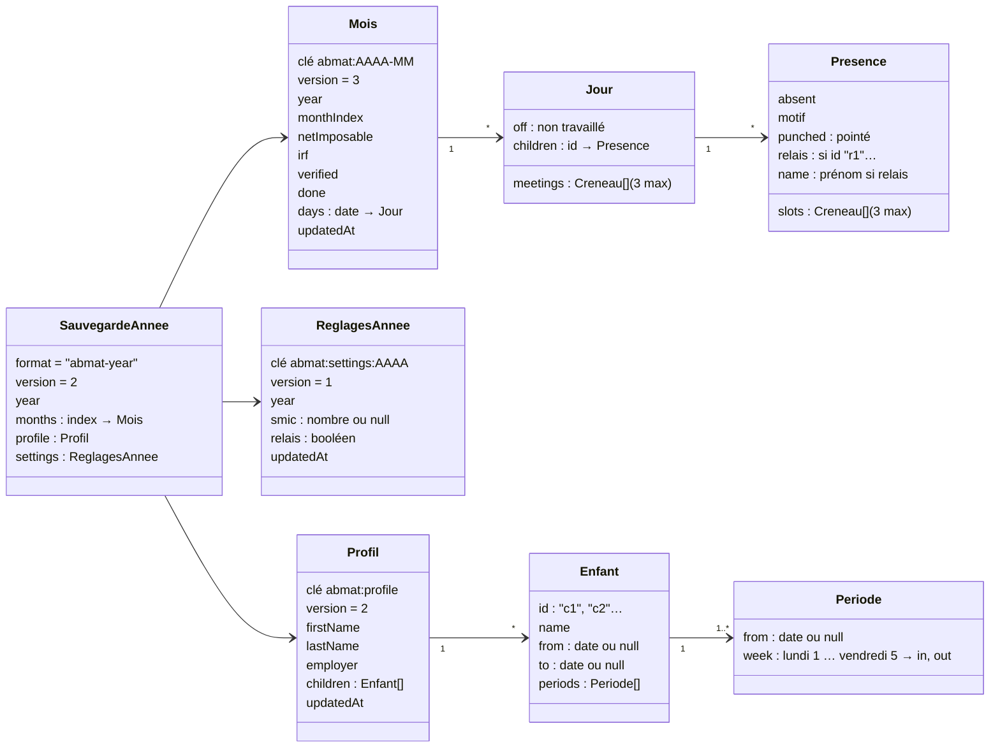

# Schéma des données — v3 (lot 12)

Tout est stocké dans le navigateur (localStorage) et voyage dans le fichier de sauvegarde d'année `abattement-assmat-AAAA.json`.

## Règles

- **Enfants** : identifiés par un id stable (`c1`, `c2`…), jamais réutilisé. Autant d'enfants que nécessaire ; `from` / `to` bornent la période d'accueil (null = pas de borne). Un jour ne contient que les enfants qui ont une donnée (présence, absence).
- **Horaires habituels versionnés** : `periods` triées par `from` ; la période en vigueur à une date est la dernière dont `from` ≤ date (`from: null` = depuis toujours). Un changement d'horaires ajoute une période ; il ne modifie jamais un jour pointé, modifié à la main, ni un mois terminé (`Compute.rescheduleMonth`).
- **Accueil relais** : présences d'id `r1`, `r2`… avec `relais: true` et `name` (prénom saisi ce jour-là). Elles comptent dans l'abattement comme les autres. Activé par année (`ReglagesAnnee.relais`).
- **4 enfants au plus en même temps** : contrôlé par `C.maxSimultaneous(jour)`, pas par le nombre d'enfants dans la journée.
- **SMIC** : un seul par année. `ReglagesAnnee.smic` s'il est réglé, sinon le barème de `config.js`, sinon « SMIC manquant » (aucun abattement calculé en silence).
- **Mois** : `verified` (jours vérifiés) et `done` (mois terminé) portent l'état du mois ; `off` marque un jour non travaillé ; `meetings` sert aux heures supplémentaires.

## Migrations (automatiques, à la lecture)

- **Mois v1 → v2 → v3** : les enfants `"1"`, `"2"`, `"3"` deviennent `c1`, `c2`, `c3` ; les entrées vides disparaissent ; `smicOverride` (mensuel) est abandonné — le SMIC est désormais réglé par année, et le barème couvre toutes les années saisies avant le lot 12.
- **Profil v1 → v2** : l'ancien `name` (« Nom et prénom ») passe dans `lastName` (à corriger dans le profil si besoin) ; `mention` (n° d'agrément) est retiré ; chaque enfant non vide devient `c1…c3` avec une période d'horaires `from: null` ; un enfant désactivé reçoit `to` = date de la migration. La migration est enregistrée une fois, sans changer `updatedAt`.
- **Sauvegarde d'année v1 → v2** : ajout de `settings` ; les anciens fichiers restent importables (fusion).
